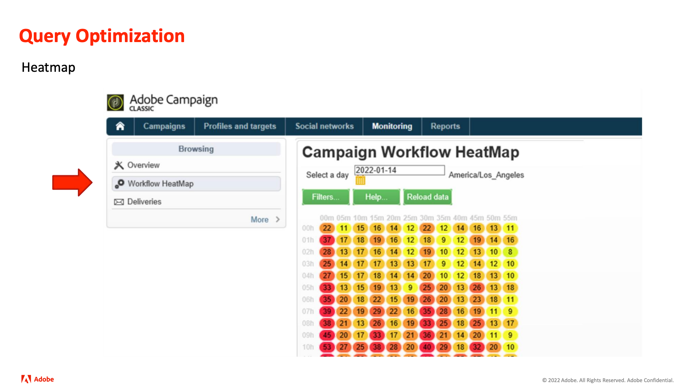

# Adobe [!DNL Campaign] Insider-reeks

Tips en trucs en inspiratie voor Adobe [!DNL Campaign] klanten helpen kanaalmarketingstrategieën te ontwikkelen, vaardigheden van teammarketingspecialisten te verhogen en organisaties te helpen geavanceerdere marketingstrategieën voor meerdere kanalen uit te voeren.

>[!TIP]
>
>**Alle geregistreerde zittingen zijn vermeld in de navigatie op de linkerzijde**.

## Topaanbieding

<table>
  <tr>
   <td>
      
      

         <a href="./2022/cross-channel.md"><strong> Niveau omhoog Uw Marketing van het Kanaal met Adobe [!DNL Campaign Classic]</strong></a>
          
      

   </td>
   <td>
      
      

         <a href="./2022/integrations.md"><strong> Adobe [!DNL Campaign] integratie met een marketing ecosysteem </strong></a>
          
      

   </td>
   <td>
      
      

         <a href="2022/tips.md"><strong> de besparingstips van de Tijd van pro </strong></a>
          
      

   </td>
</table>
