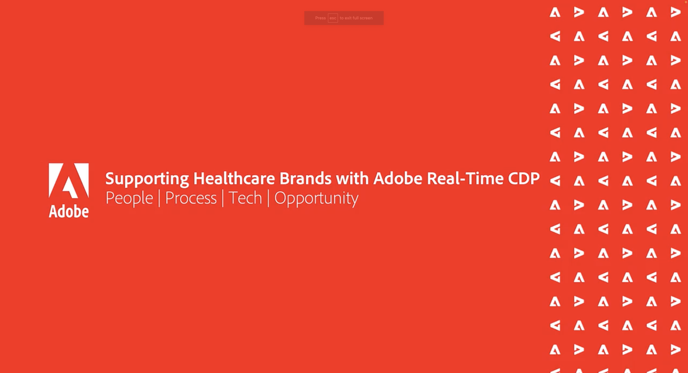

# Beheer van klantgegevens - Voices {#overview}

Welkom bij Customer Data Management Voices uw bestemming als technische en marketingdeskundige voor gegevensbeheer van klanten. Deze pagina is je one stop shop om van je collega&#39;s te horen, inspiratie te krijgen en te leren over de ontwikkelingen in de martech. Geen registratie vereist, klik en bekijk enkel.

>[!TIP]
>
>**Alle opgenomen sessies worden weergegeven in de navigatie aan de linkerkant**.

## Bouwstenen voor gegevensbeheer van klanten

<table>
  <tr>
   <td>
      
      

         <a href="./cdm/first-mile.md"><strong>Stroomlijnen van uw eerste module voor gegevensbeheer</strong></a>
          
      

   </td>
   <td>
      
      

         <a href="./cdm/cdp-success.md"><strong>Een Platform voor klantgegevens selecteren voor succes</strong></a>
          
      

    </td>
    <td>
      
      

         <a href="./cdm/people-and-process.md"><strong>Aanbevolen CDP-procedures - Personen en Proces</strong></a>
          
      

    </td>
   </tr>
   <tr> 
   <td>
      
      

         <a href="./cdm/evolving-your-audience-center-of-excellence.md"><strong>Evolving Your Audience Center of Excellence</strong></a>
          
      

    </td>
   <td>
      
      

         <a href="./cdm/building-better-experiences-with-customer-profiles.md"><strong>Betere ervaringen opbouwen met klantprofielen</strong></a>
      

      

         
    </td>
   <td>
      
      

         <a href="./cdm/how-marketing-teams-are-improving-data-management-strategies.md"><strong>Hoe de Marketing Teams de Strategieën van het gegevensbeheer verbeteren</strong></a>
      

      

      

    </td>
  </tr>
</table>

## Beheer en privacy van gegevens voor publiek en profiel

<table>
  <tr>
   <td>
      
      

         <a href="./governance/healthcare-shield.md"><strong>Adobe Real-time Customer Data Platform en Healthcare Shield</strong></a>
          
      

      

         
   </td> 
   <td>
      
      

         <a href="https://experienceleague.adobe.com/docs/platform-learn/tutorials/privacy/ten-considerations-for-responsible-customer-data-management.html"><strong>10 overwegingen voor Verantwoordelijk beheer van klantgegevens</strong></a>
          
      

      

         
    </td>
    <td>
      
      

         <a href="https://experienceleague.adobe.com/docs/platform-learn/tutorials/privacy/elevating-the-marketers-role-as-a-data-steward.html"><strong>De rol van de Markering als Data Steward verhogen</strong></a>
          
      

      

         
       

    </td>
  </tr>
</table>

## Industriële discussies

<table>
  <tr>
     <td>
      
      

         <a href="./industry/build-superb-experiences-with-your-first-party-data.md"><strong>Bouw Uitstekende Ervaring met uw Gegevens van de Eerste Partij</strong></a>
      

      

      

    </td>
     <td>
      
      

         <a href="./industry/data-collaboration-in-the-first-party-data-context.md"><strong>De Samenwerking van gegevens in de Context van Gegevens van de Eerste partij</strong></a>
      

      

      

    </td>
     <td>
      
      

         <a href="./industry/the-future-of-data-management-and-the-changing-environment.md"><strong>De toekomst van gegevensbeheer en de veranderende omgeving</strong></a>
      

      

      

    </td>
   <td>
      
      

         <a href="./industry/brands-vs-consumers.md"><strong>Een overzicht van twee percepties - merken versus consumenten</strong></a>
          
      

    </td>
  </tr>
</table>
