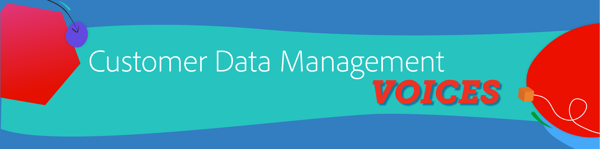

# Beheer van klantgegevens - Voices {#overview}

Welkom bij Customer Data Management Voices uw bestemming als technische en marketingdeskundige voor gegevensbeheer van klanten. Deze pagina is je one stop shop om van je collega&#39;s te horen, inspiratie te krijgen en te leren over de ontwikkelingen in de martech. Geen registratie vereist, klik en bekijk enkel.

>[!TIP]
>
>**Alle geregistreerde zittingen zijn vermeld in de navigatie op de linkerzijde**.

## Bouwstenen voor gegevensbeheer van klanten

<table>
  <tr>
   <td>
      
      

         <a href="./cdm/first-mile.md"><strong> die uw eerste Mile van het Beheer van Gegevens stroomlijnen </strong></a>
          
      

   </td>
   <td>
      
      

         <a href="./cdm/cdp-success.md"><strong> Selecterend een Platform van Gegevens van de Klant voor Succes </strong></a>
          
      

    </td>
    <td>
      
      

         <a href="./cdm/people-and-process.md"><strong> CDP Beste praktijken - Mensen en Proces </strong></a>
          
      

    </td>
   </tr>
   <tr> 
   <td>
      
      

         <a href="./cdm/evolving-your-audience-center-of-excellence.md"><strong> evoluerend Uw Centrum van de Publiek van Uitmuntendheid </strong></a>
          
      

    </td>
   <td>
      
      

         <a href="./cdm/building-better-experiences-with-customer-profiles.md"><strong> Bouwend betere ervaringen met klantenprofielen </strong></a>
      

      

         
    </td>
   <td>
      
      

         <a href="./cdm/how-marketing-teams-are-improving-data-management-strategies.md"><strong> Hoe de Teams van de Marketing de Strategieën van het Beheer van Gegevens verbeteren </strong></a>
      

      

      

    </td>
  </tr>
</table>

## Beheer en privacy van gegevens voor publiek en profiel

<table>
  <tr>
   <td>
      
      

         <a href="./governance/healthcare-shield.md"><strong> Adobe Real-time Customer Data Platform en het Schild van de Gezondheidszorg </strong></a>
          
      

      

         
   </td> 
   <td>
      
      

         <a href="https://experienceleague.adobe.com/docs/platform-learn/tutorials/privacy/ten-considerations-for-responsible-customer-data-management.html?lang=nl-NL"><strong> 10 overwegingen voor het Verantwoordelijke Beheer van de Gegevens van de Klant </strong></a>
          
      

      

         
    </td>
    <td>
      
      

         <a href="https://experienceleague.adobe.com/docs/platform-learn/tutorials/privacy/elevating-the-marketers-role-as-a-data-steward.html?lang=nl-NL"><strong> die de Rol van de Markering als Gegevens verheft </strong></a>
          
      

      

         
       

    </td>
  </tr>
</table>

## Industriële discussies

<table>
  <tr>
     <td>
      
      

         <a href="./industry/build-superb-experiences-with-your-first-party-data.md"><strong> bouwt Uitstekende Ervaringen met uw Gegevens van de Eerste Partij </strong></a>
      

      

      

    </td>
     <td>
      
      

         <a href="./industry/data-collaboration-in-the-first-party-data-context.md"><strong> Collaboration van Gegevens in de Context van Gegevens van de Eerste partij </strong></a>
      

      

      

    </td>
     <td>
      
      

         <a href="./industry/the-future-of-data-management-and-the-changing-environment.md"><strong> De Toekomst van Gegevensbeheer en het Veranderende Milieu </strong></a>
      

      

      

    </td>
   <td>
      
      

         <a href="./industry/brands-vs-consumers.md"><strong> Een Taal van Twee Percepties - Merken vs. Consumenten </strong></a>
          
      

    </td>
  </tr>
</table>
