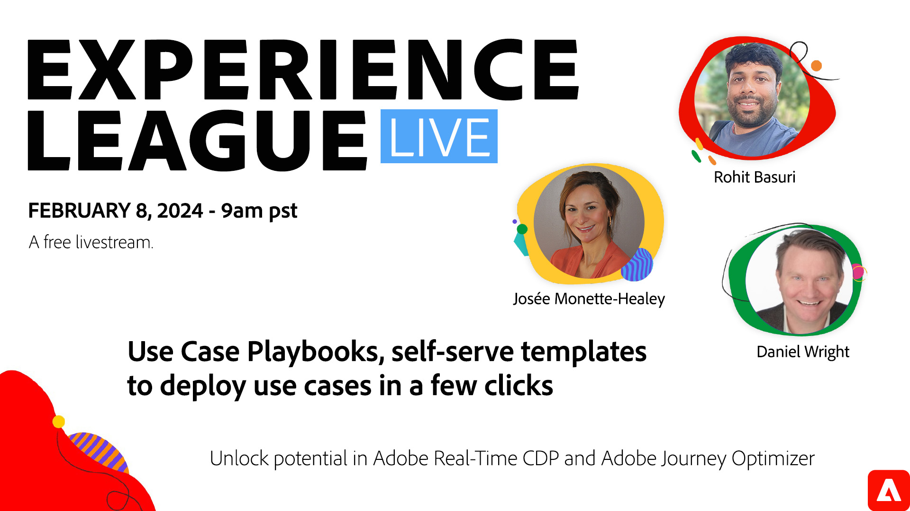

# Gebruik Hoofdletters en kleine letters, zelf-bediende malplaatjes om gebruiksgevallen in een paar klikken op te stellen

Introductie van Use Case Playbooks - een handelingencatalogus van branchespecifieke gebruiksscenario&#39;s in Real-Time CDP en Journey Optimizer. In dit webinar zult u over de Playbooks van het Geval van het Gebruik leren en hoe zij uw marketing doelstellingen in implementatievoorwerpen vertalen. Wij zullen u tonen hoe te om uw organisatie aan de bouw van en het opstellen van algemeen bekende gebruiksgevallen voor versnelde bedrijfsgevolgen en samenwerking te springen.

**Klik op de bovenstaande afbeelding om een YouTube Live-herinnering in te stellen**.

