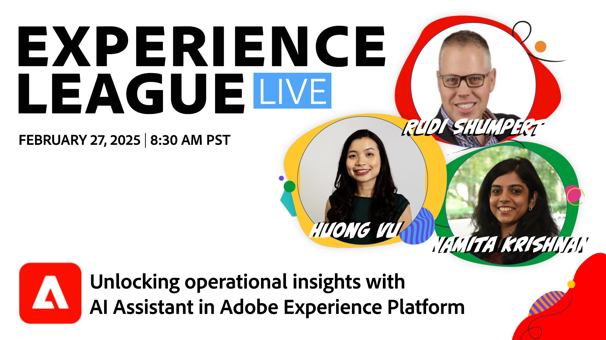

# Operationele inzichten met AI Assistant in Adobe Experience Platform ontgrendelen

Sluit u aan bij ons voor een exclusieve live sessie met productdeskundigen van de Adobe om te ontdekken hoe AI Assistant waardevolle inzichten in de bedrijfsvoering kan ontsluiten, de productiviteit kan verhogen en het werk in Adobe Experience Platform en zijn platformgebaseerde toepassingen opnieuw kan definiëren.

In deze sessie gaat u op de volgende manieren te werk:

* Hoe AI Assistant de efficiëntie en prestaties van teams in verschillende bedrijfstakken verbetert
* Hoe de teams over de organisatie, van marketing verrichtingen aan gegevensingenieurs en architecten, operationele inzichten door AI Medewerker kunnen hefboomwerking
* De nieuwste innovaties en mogelijkheden van AI Assistant die de productiviteit verhogen en workflows in Adobe Experience Platform-toepassingen opnieuw definiëren

**klik het beeld om een herinnering te plaatsen Youtube!**
