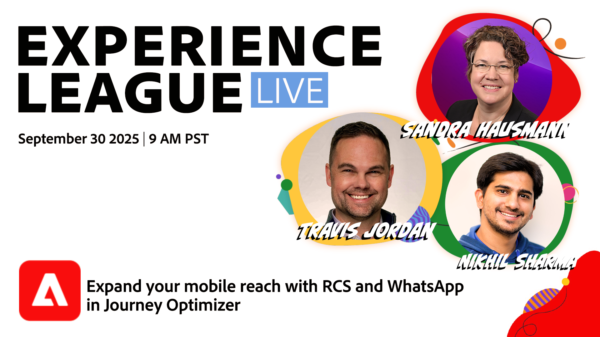

# Aangepaste inhoud in Journey Optimizer voeden met AEM Content Fragments en Dynamic Media

In deze Experience League Live show zullen Travis Jordan en Nikhil Sharma laten zien hoe Adobe Journey Optimizer de mobiele betrokkenheid onlangs heeft uitgebreid met krachtige nieuwe kanaaltoevoegingen en -functionaliteit, waaronder WhatsApp, RCS en Custom SMS Provider.

Leer hoe u rijke, gepersonaliseerde mobiele ervaringen kunt leveren die verder gaan dan gewone tekst, met functies zoals interactieve knoppen, carrousels, snelle antwoorden en meer—allemaal rechtstreeks in Journey Optimizer georkestreerd met deze nieuwe kanalen. We doorlopen de voordelen en verschillen tussen RCS en WhatsApp, bespreken hoe u deze nieuwe kanalen, waaronder API-referenties en webhaken, instelt en hoe u deze kanalen kunt opnemen in uw bestaande omnichannel betrokkenheidsstrategie.

> 

[ Register nu!](https://engage.adobe.com/ExpLeagueLive-250930.html)
