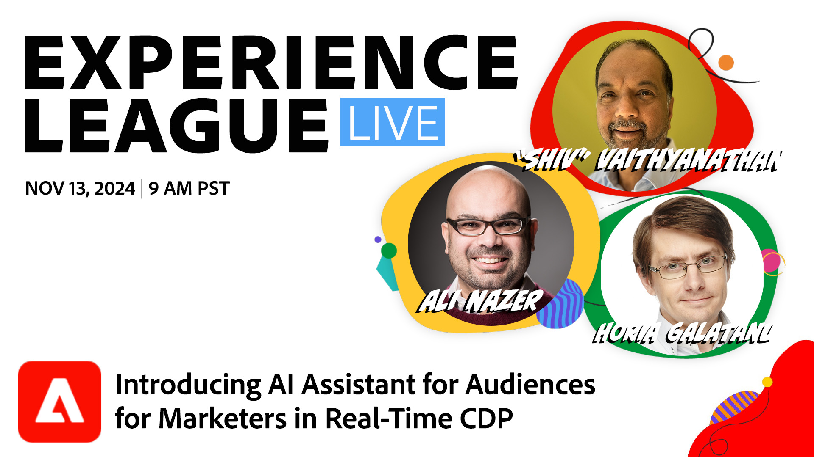

# Inleiding tot AI Assistant for Audiences for Marketers in Real-Time CDP

Doe mee voor een spannende live sessie, waar Adobe product- en engineeringexperts je een spannende blik geven op onze meest recente baanbrekende innovatie: AI Assistant for Audiences, die binnenkort naar Adobe Real-Time CDP komt om publiek inzicht en acties te bieden. Met behulp van natuurlijke taal kunnen marketers de AI Assistant voor soorten publiek gebruiken als de nieuwe toevoeging aan hun team om de omvang van het publiek te bepalen, redenen voor schommelingen te begrijpen en een krachtig doelgericht publiek te definiëren, meer gebruikscategorieën te ontsluiten en het publiek dat ertoe doet te bereiken.

[**Register voor deze gebeurtenis** ](https://engage.adobe.com/ExpLeagueLive-241113.html)
