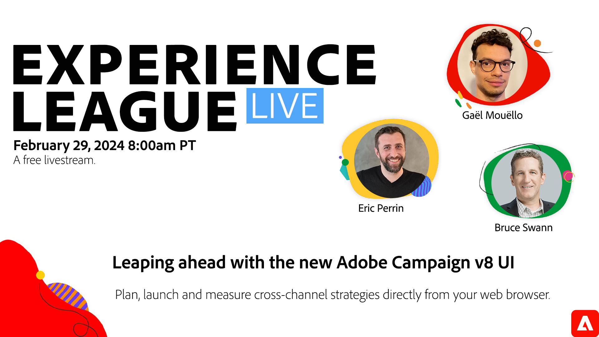

# EXPERIENCE LEAGUE LIVE

Experience League LIVE is een live streaming show die wordt gemaakt door het team van Experiencen League.  Het is een kans om met de deskundigen van het product van de Adobe te verbinden en actionable uiteinden, trucs, en strategieën te leren u met de toepassingen van Adobe Experience Cloud kunt toepassen.

## Actuele LIVE-Experience League-gebeurtenissen

<table>
<tr>
  <td style="vertical-align: top;">
    

      <a href="episodes/exl-live-episode-02-29-24.md">
        <strong>Vooruitgang boeken met de nieuwe Adobe Campaign v8-gebruikersinterface</strong>
      </a>
       <em>met Sandra Hausmann, Eric Perrin, Gaël Mouëllo, Bruce Swann</em>
       <em>29 feb. 2024</em>
    

  </td>
</tr>
</table>

## Aanbevolen door medewerkers

<table style="max-width: 1214px;">

<tr>
  <td style="vertical-align: top;">
    

      <a href="/help/experience-league-live/episodes/exl-live-episode-04-21-22.md">
        <strong>AEM van hoofdletters naar headless</strong>
      </a>
       <em>met Danny Gordon, Amol Anand, Sachin Mali en Sean Steimer</em>
       <em>21 april 2022</em>
    

  </td>

<td style="vertical-align: top;">
    
    

      <a href="episodes/exl-live-episode-08.md"><strong>Customer Journey Analytics - De binnenkant van de schelp</strong></a>
       <em>met Trevor Paulsen, Rohit Gossain, Alex Strawn</em>
       <em>25 januari 2021</em>
    

  </td>

<td style="vertical-align: top;">
    
    

      <a href="episodes/exl-live-episode-05-26-22.md">
        <strong>Vraag het de experts: De basisbeginselen van Web SDK</strong>
      </a>
       <em>met Rudi Shumpert, Jeff Chasin en Eric Matisoff</em>
       <em>26 mei 2022</em>
    

  </td>
  </tr>

</table>

>[!TIP]
>
>Ontdek gratis onze gratis leermethoden [cursussen](https://experienceleague.adobe.com/#dashboard/learning) en individuele [zelfstudies](https://experienceleague.adobe.com/docs/home-tutorials.html).
