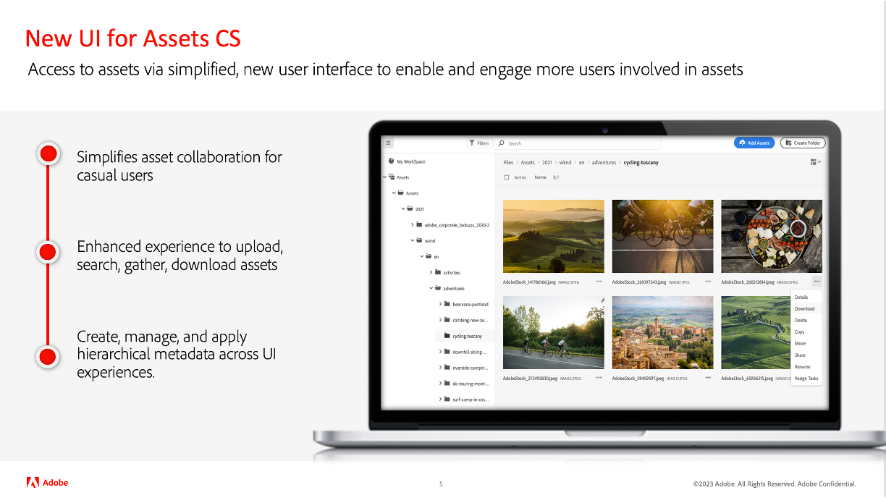

# Adobe Experience Manager as a Cloud Service-release-updates

Bekijk een kort overzicht van de nieuwste functies op Adobe Experience Manager as a Cloud Service. Dit zijn korte, ongeveer 10 minuten durende video&#39;s die door het AEM productteam worden geleverd en die de hooglichten van de nieuwste release delen.

## Laatste update

<table style="max-width: 50%;">
  <tr>
    <td>
      
      

        <a href="2023/2023-7-0.md">
          <strong>Geen | 2023,7,0</strong>
           
        </a>
          <em>Releasedatum juli 2023 </em>
      

      

        <a href="https://experienceleague.adobe.com/docs/experience-manager-cloud-service/content/release-notes/release-notes/release-notes-current.html">Aanvullende informatie</a>
      

    </td>
  </tr>  
</table>

## Oudere updates

<table style="max-width: 50%;">
  <tr>
    <td>
      
      

        <a href="2023/2023-6-0.md">
          <strong>Geen | 2023,6,0</strong>
           
        </a>
          <em>Releasedatum juni 2023 </em>
      

      

        <a href="https://experienceleague.adobe.com/docs/experience-manager-cloud-service/content/release-notes/release-notes/release-notes-current.html">Aanvullende informatie</a>
      

    </td>
    <td>
      
      

        <a href="2023/2023-4-0.md">
          <strong>Geen | 2023,4,0</strong>
           
        </a>
          <em>Releasedatum juni 2023 </em>
      

      

        <a href="https://experienceleague.adobe.com/docs/experience-manager-cloud-service/content/release-notes/release-notes/release-notes-current.html">Aanvullende informatie</a>
      

    </td>
    <td>
      
      

        <a href="2023/2023-2-0.md">
          <strong>Geen | 2023,2,0</strong>
           
        </a>
          <em>Releasedatum maart 2023 </em>
      

      

        <a href="https://experienceleague.adobe.com/docs/experience-manager-cloud-service/content/release-notes/release-notes/release-notes-current.html">Aanvullende informatie</a>
      

    </td>
    <tr>
    <td>
      
      

        <a href="2023/2023-1-0.md">
          <strong>Geen | 2023,1,0</strong>
           
        </a>
          <em>Releasedatum februari 2023 </em>
      

      

        <a href="https://experienceleague.adobe.com/docs/experience-manager-cloud-service/content/release-notes/release-notes/release-notes-current.html">Aanvullende informatie</a>
      

    </td>
    <td>
      
      

        <a href="2022/2022-10-0.md">
          <strong>Geen | 2022,10,0</strong>
           
        </a>
          <em>Releasedatum 13 oktober 2022 </em>
      

      

        <a href="https://experienceleague.adobe.com/docs/experience-manager-cloud-service/content/release-notes/release-notes/release-notes-current.html">Aanvullende informatie</a>
      

    </td>
    <td>
      
      

        <a href="2022/2022-8-0.md">
          <strong>Geen | 2022,8,0</strong>
           
        </a>
          <em>Releasedatum september 1, 2022 </em>
      

      

        <a href="https://experienceleague.adobe.com/docs/experience-manager-cloud-service/content/release-notes/release-notes/release-notes-current.html">Aanvullende informatie</a>
      

    </td>
    </tr>
    <td>
      
      

        <a href="2022/2022-7-0.md">
          <strong>Geen | 2022,7,0</strong>
           
        </a>
          <em>Releasedatum 8 augustus 2022 </em>
      

      

        <a href="https://experienceleague.adobe.com/docs/experience-manager-cloud-service/content/release-notes/release-notes/release-notes-current.html">Aanvullende informatie</a>
      

    </td>
    <td>
      
      

        <a href="2022/2022-6-0.md">
          <strong>Geen | 2022,6,0</strong>
           
        </a>
          <em>Releasedatum 30 juni 2022 </em>
      

      

        <a href="https://experienceleague.adobe.com/docs/experience-manager-cloud-service/content/release-notes/release-notes/release-notes-current.html">Aanvullende informatie</a>
      

    </td>
    <td>
      
      

        <a href="2022/2022-5-0.md">
          <strong>Geen | 2022,5,0</strong>
           
        </a>
          <em>Releasedatum 9 juni 2022 </em>
      

      

        <a href="https://experienceleague.adobe.com/docs/experience-manager-cloud-service/content/release-notes/release-notes/release-notes-current.html">Aanvullende informatie</a>
      

    </td>
  </tr>
</table>