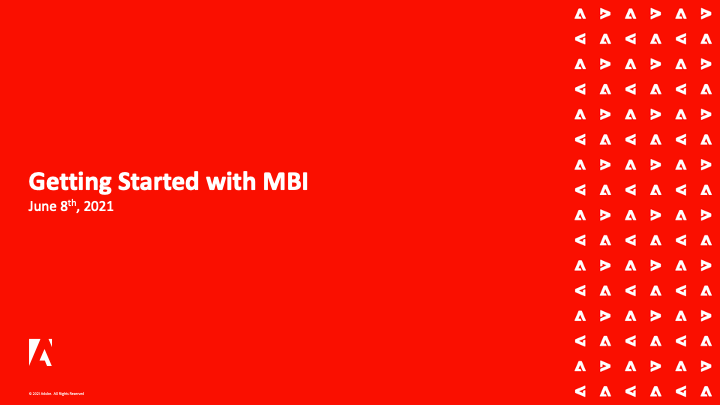
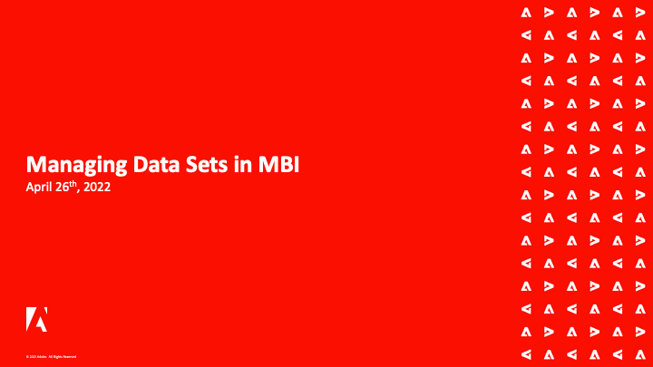

# MBI Webinars

De MBI webinar reeks is een periodieke gebeurtenis voor klanten MBI. De webinars bestrijken een breed scala aan onderwerpen en beste praktijken voor het gebruik van MBI voor het beste potentieel.

Aanwezigen uit alle landen kunnen live deelnemen aan de gebeurtenissen om het product beter te begrijpen en hun vragen over de MBI-functionaliteit rechtstreeks te beantwoorden.

De onderwerpen worden herhaald af en toe om het even welke nieuwe vragen aan te passen die de klanten kunnen stellen.

## Personeelsselectie

<table>
<tr>
  <td>
    
     

      <a href="https://experienceleague.adobe.com/docs/commerce-events/mbi/2021/getting-started.html">
        <strong>Aan de slag met MBI</strong>
      </a>
    

    

    <em>Leer rechtstreeks over de kernfunctionaliteit van MBI van het team van het Product van de Handel met een diepe duik in pre-gevormde dashboards en beschikbare aanpassingsopties.</em>
    

  </td>
  <td>
    
     

      <a href="https://experienceleague.adobe.com/docs/commerce-events/mbi/2022/manage-data-sets.html">
        <strong>Gegevenssets beheren in MBI</strong>
      </a>
    

    

    <em>Of u nu beschikt over de krachtige functies van MBI Data Warehouse Manager, rechtstreeks bij het Adobe Commerce Product-team. Ga verder dan het samenstellen van basisrapporten en leer hoe u meer kunt doen met uw gegevens.</em>
    

  </td>
   <td>
    
     

      <a href="https://experienceleague.adobe.com/docs/commerce-events/mbi/2021/optimize-data-warehouse.html">
        <strong>Uw MBI-Data Warehouse optimaliseren</strong>
      </a>
    

    

    <em>Gebruikend de Manager van de Data Warehouse, kunt u lijst en kolomsync montages beheren, neer in het schema van een lijst boren, en berekende kolommen tot stand brengen in rapporten te gebruiken.</em>
    

  </td>
</tr>
</table>

>[!TIP]
>
>**Alle opgenomen webinars worden weergegeven in de navigatie links**.

## Nuttige bronnen

- [MBI-video&#39;s en zelfstudies](https://experienceleague.adobe.com/docs/commerce-learn/tutorials/mbi/filter-sets.html)
- [MBI-gebruikershandleiding](https://experienceleague.adobe.com/docs/commerce-business-intelligence/mbi/guide-overview.html?lang=nl)
