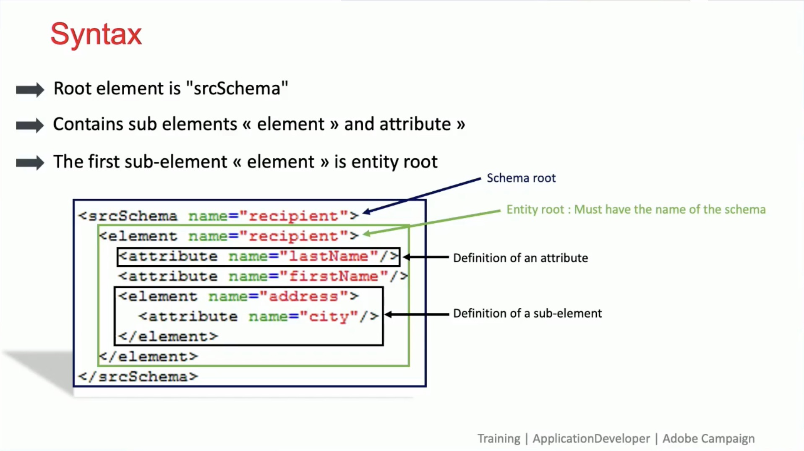

# Klantreizen

Ontwikkel klantprofielen in real time door gegevens uit alle bronnen te trekken om gepersonaliseerde, dwars-kanaalreizen tot stand te brengen.

## Nieuwe functies

<table>
<tr>
  <td>
    
     

      <a href="https://experienceleague.adobe.com/docs/skill-builder-events/skill-builder/customer-journeys/2022/b2b-campaigns.html?lang=nl-NL">
        <strong> beter samen - Adobe [!DNL Marketo Engage] en Real-Time CDP </strong>
      </a>
    

    

    <em> Leer hoe te om B2B campagnes met [!DNL Marketo Engage] en RT-CDP (B2B- uitgave) te ordenen en wat hoogste gebruiksgevallen en voordelen ontgrendeld zijn.</em>
    

  </td>
  <td>
    
     

      <a href="https://experienceleague.adobe.com/docs/skill-builder-events/skill-builder/customer-journeys/2022/data-models.html?lang=nl-NL">
        <strong> Ontwikkelen en aanpassen gegevensmodellen in Adobe [!DNL Campaign Classic]</strong>
      </a>
    

    

    <em> sluit zich aan bij deze zitting met onze Trainer van de Campagne om te leren hoe te om een gegevensschema binnen een gegevensmodel binnen [!DNL Campaign Classic] te ontwikkelen.</em>
    

  </td>  
  <td>
    
     

      <a href="https://experienceleague.adobe.com/docs/skill-builder-events/skill-builder/customer-journeys/2022/tips-and-tricks.html?lang=nl-NL">
        <strong> Hoogste Uiteinden en Tricks voor Adobe Campaign Standard </strong>
      </a>
    

    

    <em> Stop in uw instantie van Adobe Campaign Standard en ontdek beste praktijken rond het richten, verpersoonlijking en marketing vermoeidheid om een beter gebruik van ACS te hebben.</em>
    

  </td>
</tr>
</table>

>[!TIP]
>
>**Alle geregistreerde zittingen zijn vermeld in de navigatie op de linkerzijde**.
