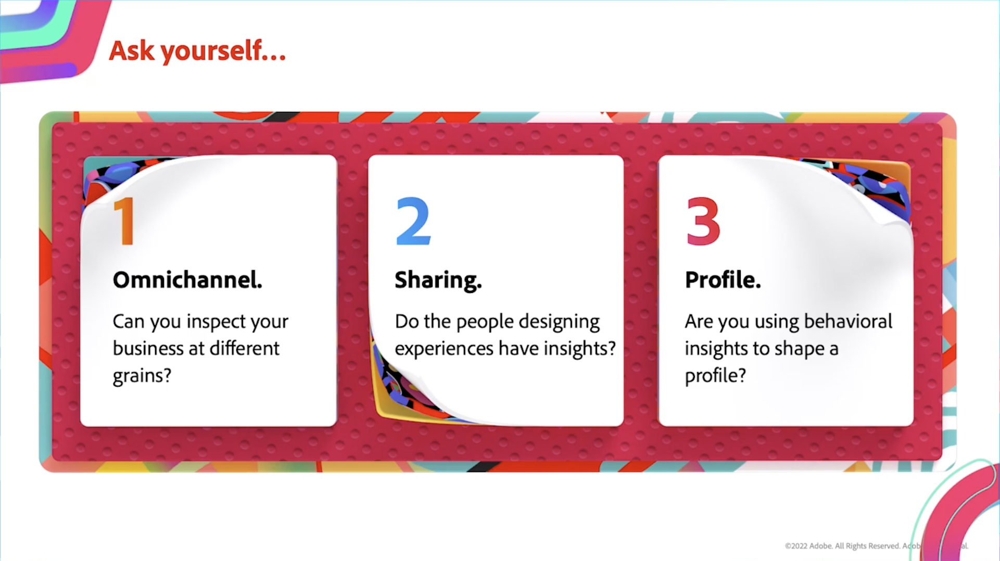

# Gegevens en inzichten

Verpersoonlijking in real time op om het even welk kanaal gebruikend online en off-line gegevensinzichten over uw volledige organisatie.

## Nieuwe functies

<table>
<tr>
  <td>
    
     

      <a href="https://experienceleague.adobe.com/docs/events/data-and-insights/2022/personalize.html">
        <strong>Personaliseren en automatiseren met Adobe Target</strong>
      </a>
    

    

    <em>Sluit u aan bij deze sessie om de kernconcepten van het automatiseren en optimaliseren van Adobe Target-mogelijkheden te leren met Auto Target en Auto Personalizations.</em>
    

  </td>
  <td>
    
     

      <a href="https://experienceleague.adobe.com/docs/events/data-and-insights/2022/innovations.html">
        <strong>2022 Innovaties en trends</strong>
      </a>
    

    

    <em>In deze keynote zitting, zult u over de hoogste tendensen in D&amp;I leren. Sluit u aan bij ons om te verkennen hoe u uw gegevens kunt gebruiken door uw Experience Cloud-investeringen volledig te maximaliseren en nieuwe innovaties te bekijken.</em>
    

  </td>  
  <td>
    
     

      <a href="https://experienceleague.adobe.com/docs/events/data-and-insights/2022/mobile-and-apps.html">
        <strong>Analyses en doeltoepassingen voor mobiele apparaten en toepassingen</strong>
      </a>
    

    

    <em>In deze sessie leert u over de beste praktijken voor het gebruik van analytische dashboards op mobiele apparaten en hoe u toepassingen kunt aanpassen via Doel.</em>
    

  </td>
</tr>
</table>

>[!TIP]
>
>**Alle opgenomen sessies worden weergegeven in de navigatie aan de linkerkant**.

