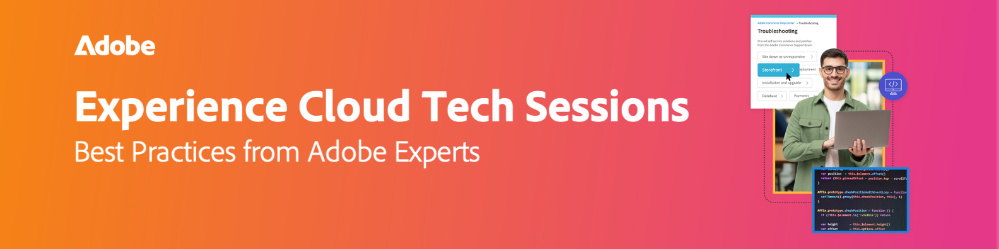

# Opnamen van technische Experience Cloud-sessies

{align="center"}

Ontgrendel het volledige potentieel van Adobe Experience Cloud met live en on-demand technische sessies. Deze webinars zijn doordacht ontworpen om verder te gaan dan de traditionele ondersteuning. De sessies worden geleid door ervaren Adobe-experts en bieden waardevolle tips, trucs en strategieën om u te helpen met vertrouwen door technische oplossingen te navigeren en gemeenschappelijke valkuilen te voorkomen. Adobe-experts zijn technici voor technische ondersteuning die zich bezighouden met de belangrijkste punten van zorg en die zich actief bezighouden met dagelijkse zaken. Met zowel live als on-demand opties hebt u de flexibiliteit om toegang te krijgen tot de informatie wanneer u deze nodig hebt, zodat u een naadloze leerervaring hebt.

## Vergaderingen 2054

<!-- CARDS
{cta = Watch}

* 2025/migrate-analytics-to-aep-web-sdk.md
* 2025/acc-delivery-performance.md
* 2025/dispatcher-configurations.md
* 2025/getting-most-marketo-measure.md
* 2025/marketo-post-migration.md
* 2025/marketo-pre-migration.md

-->
<!-- START CARDS HTML - DO NOT MODIFY BY HAND -->

    

        

            

                <figure class="image x-is-16by9">
                    
                </figure>
            

            

                

                    

                        <a href="2025/migrate-analytics-to-aep-web-sdk.md" target="_blank" rel="referrer" title="Adobe Analytics migreren naar AEP Web SDK"> Migreer Adobe Analytics aan het Web SDK van AEP </a>
                    

                    
Leer hoe u van appmeasurement.js en at.js naar AEP Web SDK (alloy.js) kunt migreren voor betere prestaties, vereenvoudigde architectuur en Adobe-integratie die klaar is voor de toekomst.

                

                <a href="2025/migrate-analytics-to-aep-web-sdk.md" target="_blank" rel="referrer" class="spectrum-Button spectrum-Button--outline spectrum-Button--primary spectrum-Button--sizeM" style="align-self: flex-start; margin-top: 1rem;">
                     Controle 
                </a>
            

        

    

    

        

            

                <figure class="image x-is-16by9">
                    
                </figure>
            

            

                

                    

                        <a href="2025/acc-delivery-performance.md" target="_blank" rel="referrer" title="Adobe Campaign Classic-leveringsprestaties - Problemen oplossen"> prestaties van de Levering van Adobe Campaign Classic - het Oplossen van problemen </a>
                    

                    
Deze sessie betrof belangrijke strategieën om de prestaties van e-mail en SMS-berichten met Adobe Campaign te verbeteren. Het behandelde gemeenschappelijke uitdagingen zoals leveringsvertragingen, lage productie, en transactiesolerantie, het aanbieden van oplossingen zoals batchoptimalisering, SQL registreren, en de controle van serverprestaties. De beste praktijken van de leveringsbaarheid omvatten juiste e-mailauthentificatie (SPF, DKIM, DMARC), zwarte lijst controle, en spamcontroles. Voor betere prestaties adviseerden de deskundigen schone werkschema's, het vertragen regels, en het vermijden van gedeelde containers. Tips voor het leveren van SMS-berichten zijn gericht op de juiste installatie van externe accounts en de analyse van logbestanden. De sessie benadrukte ook het bijhouden van validatie, databaseonderhoud met behulp van blotrapporten en het toepassen van druk- en vermoeidheidsregels om de betrokkenheid te vergroten. Een opname van een sessie wordt via e-mail gedeeld en op de website van Adobe Experience geplaatst.

                

                <a href="2025/acc-delivery-performance.md" target="_blank" rel="referrer" class="spectrum-Button spectrum-Button--outline spectrum-Button--primary spectrum-Button--sizeM" style="align-self: flex-start; margin-top: 1rem;">
                     Controle 
                </a>
            

        

    

    

        

            

                <figure class="image x-is-16by9">
                    
                </figure>
            

            

                

                    

                        <a href="2025/dispatcher-configurations.md" target="_blank" rel="referrer" title="Dispatcher Configurations in Adobe Experience Manager as a Cloud Service"> de Configuraties van Dispatcher in Adobe Experience Manager as a Cloud Service </a>
                    

                    
Ontdek de beste praktijken van AEM Dispatcher voor caching, veiligheid, en prestaties om AEM as a Cloud Service scalability en efficiency te maximaliseren.

                

                <a href="2025/dispatcher-configurations.md" target="_blank" rel="referrer" class="spectrum-Button spectrum-Button--outline spectrum-Button--primary spectrum-Button--sizeM" style="align-self: flex-start; margin-top: 1rem;">
                     Controle 
                </a>
            

        

    

    

        

            

                <figure class="image x-is-16by9">
                    
                </figure>
            

            

                

                    

                        <a href="2025/getting-most-marketo-measure.md" target="_blank" rel="referrer" title="De meesten uit Marketo Measure halen"> het Wkrijgen van het Hoogst uit Marketo Measure </a>
                    

                    
Optimaliseer Marketo Measure met de beste werkwijzen voor kanaaltoewijzing, segmentatie, aangepaste werkgebiedtoewijzing en onderdrukking van aanraakpunten. Gebruik specifieke regels, categoriseer gegevens en geef logischerwijze prioriteit aan fasen. Ongewenste aanraakpunten onderdrukken voor betere gegevens. Gebruik gereedschappen zoals boemerang-fasen en verstuur ondersteuningsgevallen voor complexe configuraties. Open de opname van de sessie op de pagina Adobe Experience.

                

                <a href="2025/getting-most-marketo-measure.md" target="_blank" rel="referrer" class="spectrum-Button spectrum-Button--outline spectrum-Button--primary spectrum-Button--sizeM" style="align-self: flex-start; margin-top: 1rem;">
                     Controle 
                </a>
            

        

    

    

        

            

                <figure class="image x-is-16by9">
                    
                </figure>
            

            

                

                    

                        <a href="2025/marketo-post-migration.md" target="_blank" rel="referrer" title="Marketo-migratie naar de Adobe Admin Console - (na migratie)"> de Migratie van Marketo aan Adobe Admin Console - (post-Migratie) </a>
                    

                    
Marketo-gebruikersbeheer centraliseren met Adobe Admin Console. Rollen (Systeem, Product, Profiel, Ondersteuningsbeheerders) en identiteitstypen beheren (Adobe, Enterprise, Federated ID). Stel SSL in voor Single Sign-On, behandel gebruikersbeheer en vernieuw certificaten om de drie jaar. Houd rekening met veel voorkomende problemen, zoals aanmeldingsproblemen en het vertrouwen van de gebruikersmap voor een uniforme ervaring. Breek grote gebruikersomzettingen in partijen van 500. Open de opname van de sessie op de Adobe Experience League-pagina.

                

                <a href="2025/marketo-post-migration.md" target="_blank" rel="referrer" class="spectrum-Button spectrum-Button--outline spectrum-Button--primary spectrum-Button--sizeM" style="align-self: flex-start; margin-top: 1rem;">
                     Controle 
                </a>
            

        

    

    

        

            

                <figure class="image x-is-16by9">
                    
                </figure>
            

            

                

                    

                        <a href="2025/marketo-pre-migration.md" target="_blank" rel="referrer" title="Marketo-migratie naar de Adobe Admin Console - (pre-migratie)"> de Migratie van Marketo aan Adobe Admin Console - (pre-Migratie) </a>
                    

                    
Adobe migreert Marketo Engage naar Admin Console voor beter gebruikersbeheer. Leer over auto en zelf-migratie types, eerste vereisten, post-migratie veranderingen, beste praktijken, gemeenschappelijke valkuilen, en steun. Open de opname van de sessie op de Adobe Experience League-website.

                

                <a href="2025/marketo-pre-migration.md" target="_blank" rel="referrer" class="spectrum-Button spectrum-Button--outline spectrum-Button--primary spectrum-Button--sizeM" style="align-self: flex-start; margin-top: 1rem;">
                     Controle 
                </a>
            

        

    

<!-- END CARDS HTML - DO NOT MODIFY BY HAND -->

## 2024 Zittingen

<!-- CARDS
{cta = Watch}

* 2024/aep-web-sdk-troubleshooting.md
* 2024/ai-assistant.md
* 2024/champion-office-hours.md
* 2024/rtcdp-timings.md
* 2024/tracking-visitors.md

-->
<!-- START CARDS HTML - DO NOT MODIFY BY HAND -->

    

        

            

                <figure class="image x-is-16by9">
                    
                </figure>
            

            

                

                    

                        <a href="2024/aep-web-sdk-troubleshooting.md" target="_blank" rel="referrer" title="AEP Web SDK — Problemen oplossen, Assurance, Tips en trucs"> het Oplossen van problemen van SDK van het Web van AEP, Assurance, en Tips en Tricks </a>
                    

                    
Sluit zich aan bij Garrett Hartley voor een uitvoerige zitting over het oplossen van problemen de werkschema's van AEP Web SDK, die op gegevensinzameling voor RTCDP, Adobe Analytics, en het richten van gemeenschappelijke implementatieuitdagingen concentreren.

                

                <a href="2024/aep-web-sdk-troubleshooting.md" target="_blank" rel="referrer" class="spectrum-Button spectrum-Button--outline spectrum-Button--primary spectrum-Button--sizeM" style="align-self: flex-start; margin-top: 1rem;">
                     Controle 
                </a>
            

        

    

    

        

            

                <figure class="image x-is-16by9">
                    
                </figure>
            

            

                

                    

                        <a href="2024/ai-assistant.md" target="_blank" rel="referrer" title="Start uw productiviteit met AI Assistant in Adobe Experience Platform"> Jumpstart Uw Productiviteit met Medewerker AI in Adobe Experience Platform </a>
                    

                    
Sluit u aan bij Rachel Hanessian en Ariel Sultan voor een inzichtelijk webinar, waar u leert om gebruiksgevallen met AI Assistant in te stellen, aan de slag te gaan en te verkennen om de productiviteit in Real-Time CDP, Journey Optimizer en Customer Journey Analytics te verhogen.

                

                <a href="2024/ai-assistant.md" target="_blank" rel="referrer" class="spectrum-Button spectrum-Button--outline spectrum-Button--primary spectrum-Button--sizeM" style="align-self: flex-start; margin-top: 1rem;">
                     Controle 
                </a>
            

        

    

    

        

            

                <figure class="image x-is-16by9">
                    
                </figure>
            

            

                

                    

                        <a href="2024/champion-office-hours.md" target="_blank" rel="referrer" title="Marketo Engage Champion Tech Sessions - mei 2024"> Marketo Engage Champion Tech Sessions - Mei 2024 </a>
                    

                    
Word lid van onze Champion Tech Sessions in mei, met ons panel van Champions Chris Kelley, Sarah Ryan, Jimmy Spencer en Briney Young, met Moderator Courtny Edwards-Jones.Of je nu nieuw bent in Marketo of gewoon je vaardigheden wilt verbeteren, onze kampioenen zijn hier om hun expertise te delen.

                

                <a href="2024/champion-office-hours.md" target="_blank" rel="referrer" class="spectrum-Button spectrum-Button--outline spectrum-Button--primary spectrum-Button--sizeM" style="align-self: flex-start; margin-top: 1rem;">
                     Controle 
                </a>
            

        

    

    

        

            

                <figure class="image x-is-16by9">
                    
                </figure>
            

            

                

                    

                        <a href="2024/rtcdp-timings.md" target="_blank" rel="referrer" title="Real-Time Content Data Platform Timings en Wat te verwachten"> Echte - tijd de Tijdopnemers van het Platform van de Gegevens van de Inhoud en wat te verwachten </a>
                    

                    
Een inzichtelijk webinar met Seth Burke, Adobe Global Lead, als hij naar de beste werkwijzen voor navigatie in het Real-Time Content Data Platform (RTCDP) gaat. Met Set doorloopt u de complexiteit van gegevensinvoer, publieksevaluatie en exporttiming en worden de belangrijkste beperkingen in elk stadium gemarkeerd.

                

                <a href="2024/rtcdp-timings.md" target="_blank" rel="referrer" class="spectrum-Button spectrum-Button--outline spectrum-Button--primary spectrum-Button--sizeM" style="align-self: flex-start; margin-top: 1rem;">
                     Controle 
                </a>
            

        

    

    

        

            

                <figure class="image x-is-16by9">
                    
                </figure>
            

            

                

                    

                        <a href="2024/tracking-visitors.md" target="_blank" rel="referrer" title="Bezoekers bijhouden in het steeds veranderende landschap van cookies, browsers en bibliotheken"> het Volgen Bezoekers in het ver-Veranderende Landschap van Koekjes, Browsers, en Bibliotheken </a>
                    

                    
Meld u aan voor een informatieve webinar met Garrett Hartley, Senior Technical Support Engineer van het Customer Experience team van Adobe. In deze sessie deelt Garrett de beste praktijken voor het bijhouden van bezoekers in het zich ontwikkelende landschap van cookies, browsers en bibliotheken van vandaag. Eerdere implementatiestrategieën worden besproken en effectieve migratiepaden worden onderzocht om moderne methoden voor het bijhouden van bezoekers te gebruiken. Verwacht dat u verouderde mythes kunt wegvagen en meer kunt leren over geavanceerde benaderingen om uw systemen voor het volgen van foto's te verbeteren.

                

                <a href="2024/tracking-visitors.md" target="_blank" rel="referrer" class="spectrum-Button spectrum-Button--outline spectrum-Button--primary spectrum-Button--sizeM" style="align-self: flex-start; margin-top: 1rem;">
                     Controle 
                </a>
            

        

    

<!-- END CARDS HTML - DO NOT MODIFY BY HAND -->

## 2023 Zittingen

<!-- CARDS

{cta = Watch}

* 2023/ac-sms-channel-overview.md
* 2023/aem-deployment-failures-analysis.md
* 2023/aem-forms-headless-architecture.md
* 2023/aep-admin-console-permissions.md
* 2023/launch-best-practices.md
* 2023/marketo-common-pitfalls.md
* 2023/migration-aemcs.md
* 2023/optimize-indexes-aemcs.md
* 2023/site-wide-analysis-tool.md
* 2023/target-debugging-tips-and-tricks.md
* 2023/workfront-fix-duplicate-contacts.md
* 2023/workfront-proof-approval-reports.md

-->
<!-- START CARDS HTML - DO NOT MODIFY BY HAND -->

    

        

            

                <figure class="image x-is-16by9">
                    
                </figure>
            

            

                

                    

                        <a href="2023/ac-sms-channel-overview.md" target="_blank" rel="referrer" title="Tips voor overzicht en probleemoplossing van SMS-kanalen"> het Overzicht van het Kanaal van SMS &amp; het Oplossen van problemen Tips </a>
                    

                    
Omvat de Architectuur van SMS, vormt het Kanaal van SMS, vormt de Externe Rekening SMPP, creeert de Levering van SMS, en het Oplossen van problemen.

                

                <a href="2023/ac-sms-channel-overview.md" target="_blank" rel="referrer" class="spectrum-Button spectrum-Button--outline spectrum-Button--primary spectrum-Button--sizeM" style="align-self: flex-start; margin-top: 1rem;">
                     Controle 
                </a>
            

        

    

    

        

            

                <figure class="image x-is-16by9">
                    
                </figure>
            

            

                

                    

                        <a href="2023/aem-deployment-failures-analysis.md" target="_blank" rel="referrer" title="AEM as a Cloud Service-analyse van implementatiefouten"> Analyse van mislukkingen van de Plaatsing van AEM as a Cloud Service </a>
                    

                    
Interne AEM as a Cloud Service-implementaties en probleemoplossing.

                

                <a href="2023/aem-deployment-failures-analysis.md" target="_blank" rel="referrer" class="spectrum-Button spectrum-Button--outline spectrum-Button--primary spectrum-Button--sizeM" style="align-self: flex-start; margin-top: 1rem;">
                     Controle 
                </a>
            

        

    

    

        

            

                <figure class="image x-is-16by9">
                    
                </figure>
            

            

                

                    

                        <a href="2023/aem-forms-headless-architecture.md" target="_blank" rel="referrer" title="AEM Forms Headless-architectuur"> AEM Forms Headless Architectuur </a>
                    

                    
Maak kennis met Headless Architecture, de voordelen van AEM Forms Headless en Live Demo.

                

                <a href="2023/aem-forms-headless-architecture.md" target="_blank" rel="referrer" class="spectrum-Button spectrum-Button--outline spectrum-Button--primary spectrum-Button--sizeM" style="align-self: flex-start; margin-top: 1rem;">
                     Controle 
                </a>
            

        

    

    

        

            

                <figure class="image x-is-16by9">
                    
                </figure>
            

            

                

                    

                        <a href="2023/aep-admin-console-permissions.md" target="_blank" rel="referrer" title="Adobe Experience Platform - Admin Console-machtigingen"> Adobe Experience Platform - de Toestemmingen van Admin Console </a>
                    

                    
Admin-console en wat er is veranderd, de nieuwe toegangsbesturingselementen in de RTCDP UI, Adobe.io/developer-console en hoe u machtigingen instelt voor uw integratie van RTCDP API.

                

                <a href="2023/aep-admin-console-permissions.md" target="_blank" rel="referrer" class="spectrum-Button spectrum-Button--outline spectrum-Button--primary spectrum-Button--sizeM" style="align-self: flex-start; margin-top: 1rem;">
                     Controle 
                </a>
            

        

    

    

        

            

                <figure class="image x-is-16by9">
                    
                </figure>
            

            

                

                    

                        <a href="2023/launch-best-practices.md" target="_blank" rel="referrer" title="Aanbevolen werkwijzen starten"> Beste praktijken van de Lancering </a>
                    

                    
In deze sessie leert u meer over configuraties, instellingen en valkuilen, onvoldoende ontwikkelde mogelijkheden en algemene workflows voor probleemoplossing.

                

                <a href="2023/launch-best-practices.md" target="_blank" rel="referrer" class="spectrum-Button spectrum-Button--outline spectrum-Button--primary spectrum-Button--sizeM" style="align-self: flex-start; margin-top: 1rem;">
                     Controle 
                </a>
            

        

    

    

        

            

                <figure class="image x-is-16by9">
                    
                </figure>
            

            

                

                    

                        <a href="2023/marketo-common-pitfalls.md" target="_blank" rel="referrer" title="Geavanceerde slimme-lijstlogica en algemene valkuilen"> Geavanceerde Slimme Logica van de Lijst &amp; Gemeenschappelijke Punten </a>
                    

                    
overzicht van complexe en geavanceerde slimme lijstlogica, ALLES, OM HET EVEN WELKE en Geavanceerde Filters, veelvoudige trekkers, negatieve filters en negatieve beperkingen, gemeenschappelijke kwesties, en het oplossen van problemenuiteinden

                

                <a href="2023/marketo-common-pitfalls.md" target="_blank" rel="referrer" class="spectrum-Button spectrum-Button--outline spectrum-Button--primary spectrum-Button--sizeM" style="align-self: flex-start; margin-top: 1rem;">
                     Controle 
                </a>
            

        

    

    

        

            

                <figure class="image x-is-16by9">
                    
                </figure>
            

            

                

                    

                        <a href="2023/migration-aemcs.md" target="_blank" rel="referrer" title="Migratie naar AEM Cloud Service"> Migratie aan de Dienst van de Wolk AEM </a>
                    

                    
Leer technieken en de beschikbare hulpmiddelen om de migratie naar AEM Cloud Service te vereenvoudigen. Van het Hulpmiddel van de Overdracht van de Inhoud aan nieuwe Cloud Acceleration Manager die samen met de Analysator van Beste praktijken wordt gebruikt om uw milieu te beoordelen.

                

                <a href="2023/migration-aemcs.md" target="_blank" rel="referrer" class="spectrum-Button spectrum-Button--outline spectrum-Button--primary spectrum-Button--sizeM" style="align-self: flex-start; margin-top: 1rem;">
                     Controle 
                </a>
            

        

    

    

        

            

                <figure class="image x-is-16by9">
                    
                </figure>
            

            

                

                    

                        <a href="2023/optimize-indexes-aemcs.md" target="_blank" rel="referrer" title="Stichting voor het optimaliseren van indexen met AEM Cloud Service"> Stichting voor het Optimaliseren van Indexen met de Dienst van de Wolk AEM </a>
                    

                    
AEM CS Indexing verandert en hoe dat verschillende projecten beïnvloedt, uitdagingen klanten worden geconfronteerd met indexen op AEMaaCS, en beste praktijken voor het optimaliseren van deze indexen

                

                <a href="2023/optimize-indexes-aemcs.md" target="_blank" rel="referrer" class="spectrum-Button spectrum-Button--outline spectrum-Button--primary spectrum-Button--sizeM" style="align-self: flex-start; margin-top: 1rem;">
                     Controle 
                </a>
            

        

    

    

        

            

                <figure class="image x-is-16by9">
                    
                </figure>
            

            

                

                    

                        <a href="2023/site-wide-analysis-tool.md" target="_blank" rel="referrer" title="Analyse voor de hele site"> plaats-brede het Hulpmiddel van de Analyse </a>
                    

                    
In deze sessie leert u meer over SWAT-overzicht en live demo (SWAT Cloud Sandbox)

                

                <a href="2023/site-wide-analysis-tool.md" target="_blank" rel="referrer" class="spectrum-Button spectrum-Button--outline spectrum-Button--primary spectrum-Button--sizeM" style="align-self: flex-start; margin-top: 1rem;">
                     Controle 
                </a>
            

        

    

    

        

            

                <figure class="image x-is-16by9">
                    
                </figure>
            

            

                

                    

                        <a href="2023/target-debugging-tips-and-tricks.md" target="_blank" rel="referrer" title="JavaScript Library Overview, Debugging Tips &amp; Tricks"> het Overzicht van de Bibliotheek van JavaScript, het Zuiveren Tips &amp; Tricks </a>
                    

                    
De recentste versies en eigenschappen, hoe te om at.js te zuiveren, het oplossen van problemen levende demo, zelf-steunmiddelen, en hoe te met steun in dienst te nemen.

                

                <a href="2023/target-debugging-tips-and-tricks.md" target="_blank" rel="referrer" class="spectrum-Button spectrum-Button--outline spectrum-Button--primary spectrum-Button--sizeM" style="align-self: flex-start; margin-top: 1rem;">
                     Controle 
                </a>
            

        

    

    

        

            

                <figure class="image x-is-16by9">
                    
                </figure>
            

            

                

                    

                        <a href="2023/workfront-fix-duplicate-contacts.md" target="_blank" rel="referrer" title="Dubbele contactpersonen corrigeren"> bevestig Dubbele Contacten </a>
                    

                    
Hoe te om een bewijs tot stand te brengen, hoe te om de kwesties van de contactsynchronisatie te identificeren en op te lossen, en hoe te de mislukkingen van de proefdrukgeneratie op te lossen.

                

                <a href="2023/workfront-fix-duplicate-contacts.md" target="_blank" rel="referrer" class="spectrum-Button spectrum-Button--outline spectrum-Button--primary spectrum-Button--sizeM" style="align-self: flex-start; margin-top: 1rem;">
                     Controle 
                </a>
            

        

    

    

        

            

                <figure class="image x-is-16by9">
                    
                </figure>
            

            

                

                    

                        <a href="2023/workfront-proof-approval-reports.md" target="_blank" rel="referrer" title="Goedkeuringsrapporten proefdrukken"> de Rapporten van de Goedkeuring van het Bewijs </a>
                    

                    
Leer hoe u goedkeuringsrapporten voor proefdrukken maakt.

                

                <a href="2023/workfront-proof-approval-reports.md" target="_blank" rel="referrer" class="spectrum-Button spectrum-Button--outline spectrum-Button--primary spectrum-Button--sizeM" style="align-self: flex-start; margin-top: 1rem;">
                     Controle 
                </a>
            

        

    

<!-- END CARDS HTML - DO NOT MODIFY BY HAND -->
