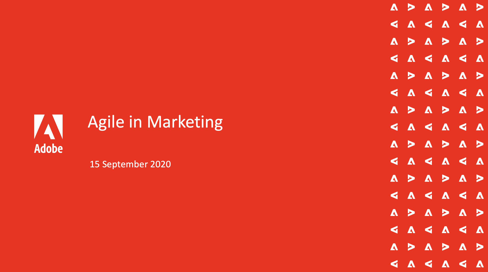

# Workfront On-Demand Events {#overview}

Een bibliotheek met opgenomen Workfront-gebeurtenissen waarbij experts en collega&#39;s gedachten uitwisselen over het gebruik van Workfront.

## Aanbevolen sessies

<table>
  <tr>
   <td>
      
      

         <a href="user-groups/workfront-system-maintenance.md"><strong>Workfront-systeemonderhoud</strong></a>
<!---          <em>foo</em> -->
      

      

         
         In een deelvenster met systeembeheerders worden de volgende zaken besproken die u in overweging kunt nemen: systeeminstallatie, regelmatig onderhoud en opschoning.
      

    </td>
   <td>
      
      

         <a href="user-groups/reporting-and-dashboards.md"><strong>Rapportage en dashboards</strong></a>
<!---          <em>foo</em> -->
      

      

         
         Bekijk rapporten en dashboards die anderen voor hun organisaties en de beste praktijken hebben gecreeerd zij hebben geleerd.
      

    </td>
   <td>
      
      

         <a href="user-groups/agile-in-marketing.md"><strong>Geniet van marketing</strong></a>
<!---          <em>foo</em> -->
      

      

         
         De deskundige van de behendigheid bespreekt de hoge punten en de tendensen die zij met behendige, algemene behendigheid in zaken hebben gezien, en hoe zij Workfront voor behendigheid gebruiken.
      

    </td>
  </tr>
</table>
